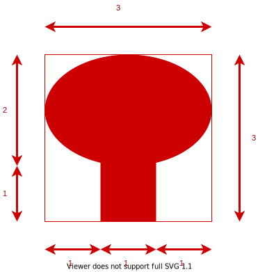

# Riadny termín \[60b], 3.6.2021 14:00
B-OOP 2021

Vytvorte oknovú aplikáciu, ktorá umožní používateľovi kresliť a presúvať zadaný tvar. Aplikácia bude mať nasledovnú funkcionalitu (40 bodov):

1. Vytvorenie hlavného okna, ktoré bude obsahovať Ovládacie prvky a Kresliacu plochu \[5b].
2. Kreslenie jedného tvaru: strom \[15b].
3. Presúvanie už nakreslených tvarov \[15b].
4. Voľba farby geometrického tvaru prostredníctvom [JButton](https://docs.oracle.com/en/java/javase/11/docs/api/java.desktop/javax/swing/JButton.html) \[4b].
5. Zatvorenie aplikácie cez tlačidlo na zatvorenie aplikácie \[1b].

## Podrobný popis k bodu 1:

Väčšinu plochy okna bude zaberať Kresliaca plocha. V dolnej časti okna sa budú nachádzať Ovládacie
prvky. Ovládacie prvky budú tvoriť: [JButton](https://docs.oracle.com/en/java/javase/11/docs/api/java.desktop/javax/swing/JButton.html) “Strom”, [JButton](https://docs.oracle.com/en/java/javase/11/docs/api/java.desktop/javax/swing/JButton.html) “Presun”, [JButton](https://docs.oracle.com/en/java/javase/11/docs/api/java.desktop/javax/swing/JButton.html) “Ďalšia farba” a [JLabel](https://docs.oracle.com/en/java/javase/11/docs/api/java.desktop/javax/swing/JLabel.html). Každý z týchto prvkov musí zaberať štvrtinu celkového miesta vyhradeného pre ovládacie prvky.

## Podrobný popis k bodu 2:

Stlačením príslušného tlačidla si vyberieme kreslenie STROMU [5b]. Po stlačení tlačidla myši (kliknutí) a následným ťahaním, sa na plátno vykresľuje geometrický tvar, a v Labeli (medzi ovládacími prvkami) sa nastaví text, ktorý bude hovoriť, že je aktívne **KRESLENIE**. Podľa aktuálnej polohy kurzora sa dynamicky mení šírka aj výška. Po pustení tlačidla myši sa ukončí kreslenie geometrického tvaru, t.j. jeho veľkosť sa zafixuje, potom sme pripravení kresliť ďalší tvar. Vykreslený tvar musí na kresliacej ploche zostať vykreslený aj po vykreslení ďalšieho tvaru. Takisto si každý tvar musí zachovávať svoju farbu (farba sa bude meniť Button-om, pozri bod 4). Strom musí mať pri kreslení zachované proporcie, ako je znázornené na obrázku.

**Pozn.:** Pri kreslení (ťahaní myšou) zvoleného geometrického tvaru sa musí uvažovať, do akého smeru sa ťahá. Vtedy je potrebné domyslieť, ako sa budú prepočítavať koncové súradnice geometrického tvaru. Ak implementujete prepočítavanie koncového bodu v závislosti od všetkých smerov ťahania myšou (sprava hore - doľava dole, zľava dole - doprava hore, zľava hore - doprava dole a opačne) získate za tento bod plný počet [10b]. Ak neimplementujete všetky 4 alternatívy prepočítavania súradníc koncového bodu (ťahania myšou), získate maximálne polovicu zo stanovených bodov. (max 5b).

## Podrobný popis k bodu 3:

Stlačením príslušného tlačidla si vyberieme mód PRESÚVANIA a Labeli (medzi ovládacími prvkami) sa nastaví text, ktorý bude hovoriť, že je aktívne **PRESÚVANIE**. Po stlačení tlačidla myši (kliknutí) na nejaký už nakreslený tvar a následnom ťahaní sa zvolený tvar bude presúvať spolu s pohybom myši. Po pustení tlačidla myši sa presúvanie ukončí, t.j. presúvaný tvar zostane na svojom novom mieste. Presúvaný tvar sa vykresľuje iba spolu s myšou a nezostáva na svojej pôvodnej pozícii.

**Pozn.:** Pri presúvaní (ťahaní myšou) zvoleného tvaru je potrebné brať do úvahy relatívnu polohy myši ku presúvanému tvaru. Za implementáciu presúvania akýmkoľvek spôsobom je možné získať maximálne 10b. Pokiaľ sa presúvanie uskutočňuje relatívne ku miestu kde bol tvar vybratý myšou (t.j. keď kliknem do stredu útvaru presúvam ho tak, že myš zostáva v strede) dá sa za presúvanie získať plný počet 15b.

Na detekciu kliknutia myši na tvar môžete použiť napríklad metódu [contains](https://docs.oracle.com/en/java/javase/11/docs/api/java.desktop/java/awt/Shape.html#contains(double,double)) triedy [Shape](https://docs.oracle.com/en/java/javase/11/docs/api/java.desktop/java/awt/Shape.html)

## Podrobný popis k bodu 4:

Spomedzi ovládacích prvkov bude Button "Ďalšia farba" slúžiť na výber farby a Label na grafické znázornenie aktuálne  zvolenej farby. Program umožňuje zvoliť minimálne 3 farby v nejakom fixnom poradí (napr. červená > modrá > zelená). Tlačidlom sa aktívna farba zmení na nasledujúcu farbu v poradí. Pokiaľ sa v zozname farieb nachádzame na poslednom prvku, tak za ním nasleduje opäť prvá farba (t.j. červená > modrá > zelená > červená > ...). Práve kreslené geometrické tvary majú farbu zvolenú podľa aktuálnej farby. Farby môžu byť ľubovoľné, podmienkou ale je, aby boli viditeľné na kresliacej ploche. Po výbere farby sa zmení farba Label-u podľa aktuálnej farby. Zmena farby ovplyvňuje len nové geometrické tvary, už nakreslené geometrické tvary si musia zachovať svoju farbu!

## Hodnotenie

Projekt obsahuje github pipeline, ktorá kontroluje skompilovateľnosť programu. **Pokiaľ program nie je skompilovateľný nebude hodnotený a skúška bude hodnotená 0b!**

Okrem funkcionality budú hodnotené aj princípy Objektovo orientovaného programovania (20 bodov), najmä:

* správne využitie modifikátory prístupu, \[3b]
* vhodné pomenovanie tried a metód, \[3b]
* vhodné využitie dedenia a polymorfizmu, \[3b]
* vhodné použitie výnimiek na ošetrenie nedovoleného správania (nehádzať a nezachytávať všeobecnú triedu Exception), \[3b]
* nepoužitie vnorených tried (nested class), \[2b]
* nepoužitie statických metód ani nekonštantných statických premenných, \[3b]
* nepoužitie duplicitných kódov \[3b]

## Odovzdanie

Vypracovanie skúšky odovzdajte cez Github classroom do miesta odovzdania nato určenom. Odovzdáva sa obsah celého projektu. Na vypracovanie písomky je vyhradený čas 3 hodiny.

# Assignment 2 - Rook in a maze
B-OOP 2021

Your task is to create a java window application with the Swing library. The user interface of the application must consist of:
* canvas
* side menu (you can choose the location of this side menu freely)

When the application starts, generate a maze using the [randomized depth first search](https://www.baeldung.com/cs/maze-generation#dfs-maze) algorithm and draw it onto the canvas.
The grid containing the maze must be at least 11x11 tiles large (including wall tiles). The entire maze must be surrounded by walls (no paths in the maze can touch the borders of the window).

In the generated maze choose in any way a starting and a goal point. Place the player figure on the starting point. The player can move their figure in 3 ways:
* by using the arrows keys on their keyboard. Always by one tile in the specified direction. They cannot enter a tile that contains a wall.
* by using the mouse. When the player figure is clicked, it can be moved like a rook chess piece (i.e. any number of tiles in the horizontal, or vertical directions).
The destination is chosen by a second mouse click. Tiles that can be moved to in this manner must be highlighted, when the mouse hovers over them. When moving in this manner, the player cannot jump over walls.
* by using buttons on the side menu, that represent the arrow keys. The rules for moving in this manner are the same, as for the movement by the arrow keys on the keyboard.

When the player reaches the goal point, the application should generate a new maze and the game starts over.

The side menu must contain:
* a counter of successfully completed mazes
* a button that resets the counter and generates a new maze
* buttons representing the arrow keys, which can be used to move the player. These buttons must be placed in the same way, they are placed on a regular keyboard.

## Grading
You can get 15 points for this assignment. **The program must be able to compile, otherwise 0 points are given for the assigment**.
The github pipeline checks whether the program can be compiled. The main focus during grading is put on object-oriented approach and OOP principles used by the solution.
Including, but not limited to:
* appropriate naming of classes, methods and variables in a single language (class names starting with a capital letter, method names starting with a lowercase letter),
* appropriate use of access modifiers (public, private, or protected) when restricting access to class methods and attributes,
* the use of inheritance and polymorphism,
* usage of exceptions when handling undesired behavior (do not catch or throw the instances of the generic Exception class),
* don't use nested classes,
* don't use static methods, or non-constant static variables (you don't need them to complete the assignment),
* don't put any logic into the main method and its class. The main method should only be used to create a new object,
* you can use the lombok library and its annotations in your solution. The neccessary dependency is already present in the _pom.xml_ file.

## Handing in the assigment
Clone the assignment from the repository created from this template by the provided link trough GitHub Classroom (if you create your own repository with the "use this template" button, we won't be able to see your repository and we won't be able to grade it!). Upload your solutions to your repository using the Git version control system (git commit + git push).
Make sure, that your repository was created under the **Interes-Group** group, otherwise we won't be able to access your repository, and the assignment will not be graded.
You can push commits to the repository while you work - you don't have to push everything at once. Only the code in the _master_ branch will be graded. You have until **23.4.2021 23:00** to complete the assignment.

Only edit files in the _src/main_ folder or its sub-folders. You mustn't change any other files in the repository (especially the _pom.xml_ file, and the github pipeline files).

You have to have your name set in your github account (settings > profile > name), so that we can match students with their assignments. **If we are unable to match a student with their assignment, the student will receive 0 points for the assignment!**
